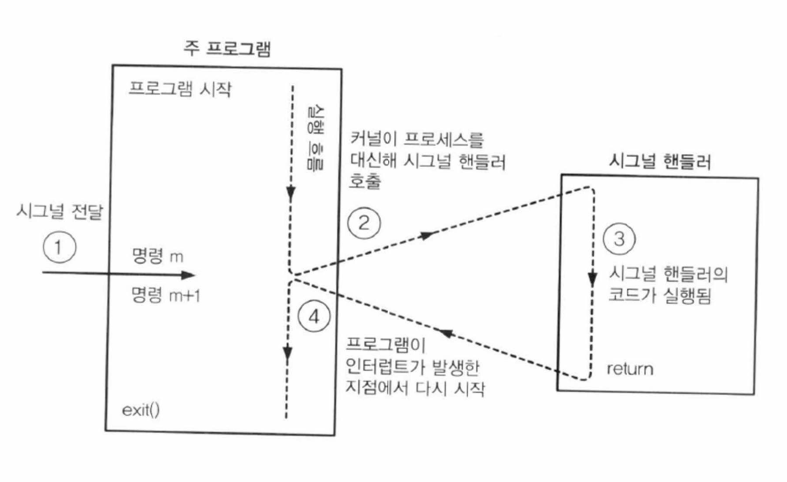

Linux Signals
==============

1.시그널(signal)이란?
------------
- 초기 UNIX 시스템에서 간단하게 프로세스간 통신을 하기 위한 메커니즘
- 간단하고 효율적
- 프로세스나 프로세스 그룹에 보내는 짧은 메시지(식별번호)
- 커널도 시스템 이벤트를 프로세스에 알리기 위해 사용
- 프로세스에 무엇인가 발생했음을 알리는 간단한 메시지를 비동기적으로 보내는 것이다.
- 시그널을 받은 프로세스는 시그널에 따른 미리 지정된 기본 동작(default action)을 수행할 수도 있고, 사용자가 미리 정의해 놓은 함수에 의해서 무시하거나, 특별한 처리를 할 수 있다.

2.시그널(signal)종류
-----------
번호|신호 이름|기본처리|발생조건
----|--------|-------|--------
1|SIGHUP|종료|터미널과 연결이 끊어졌을때
2|SIGINT|종료|인터럽트로 ctrl + c 입력시
3|SIGQUIT|코어 덤프|ctrl + \ 입력시
4|SIGLL|코어 덤프|잘못된 명령 사용
5|SIGTRAP|코어 덤프|trace, breakpoint에서 TRAP 발생
6|SIGABRT|코어 덤프|abort(비정상종료) 함수에 의해 발생
7|SIGBUS|코어 덤프|버스 오류시
8|SIGFPE|코어 덤프|Floating-point exception
9|SIGKILL|종료|강제 종료시
10|SIGUSR1|종료|사용자 정의 시그널1
11|SIGSEGV|코어 덤프|세그먼테이션 폴트 시
12|SIGUSR2|종료|사용자 정의 시그널2
13|SIGPIPE|코어 덤프|파이프 처리 잘못했을때
14|SIGALRM|코어 덤프|알람에 의해 발생
15|SIGTERM|종료|Process termination
16|SIGSTKFLT|종료|Coprocessor stack error
17|SIGCHLD|무시|자식 프로세스(child process)상태 변할때
18|SIGCONT|무시|중지된 프로세스 실행시
19|SIGSTOP|중지|SIGSTOP 시그널을 받으면 SIGCONT시그널을 받을때까지 프로세스 중지
20|SIGSTP|중지|ctrl + z 입력시
21|SIGTTIN|중지|Background process requires input
22|SIGTTOU|중지|Background process requires output
23|SIGURG|무시|Urgent condition on socket
24|SIGXCPU|코어 덤프|CPU time limit exceeded
25|SIGXFSZ|코어 덤프|File size limit exceeded
26|SIGVTALRM|종료|가상 타이머 종료시
27|SIGPROF|종료|Profile timer clock
28|SIGWINCH|무시|Window resizing
29|SIGIO|종료|I/O now possible
30|SIGPWR|종료|Power supply failure
31|SIGSYS|코어 덤프|system call 잘못했을때

3.시그널(signal)속성
-------------------
- signal()의 handler인자로 함수의 주소를 명시하는 대신, 다음 값 중에 하나를 명시 할 수 있다.
1. SIG_DFL
> 시그널 속성을 기본 값으로 재설정
2. SIG_IGN
> 시그널을 무시한다.
- signal()을 성공적으로 호출하면 시그널의 이전 속성이 리턴된다. 이전에 사용된 핸들러 함수의 주소이거나, 상수 SIG_DFL, SIG_IGN중 하나 일 것이다.
에러시 signal()은 SIG_ERR값을 리턴한다.

4.시그널(signal) 핸들러
----------------------
- 시그널핸들러(시그널 캐쳐)는 명시된 시그널이 프로세스로 전달되면 호출되는 함수.
- 시그널 핸들러의 실행은 언제든지 메인 프로그램의 흐름을 멈출 수 있다.
- 커널은 프로세스를 위해 핸들러를 호출하고, 핸들러가 리턴될 때 프로그램의 실행은 핸들러가 인터럽트 한 곳에서 다시 시작한다.

### 시그널의 전달 및 핸들러 수행


### 시그널핸들러 실습

#### 1. SIG_INT와 SIG_QUIT를 받는 시그널 핸들러
```c
#include<stdio.h>
#include<signal.h>
#include<unistd.h>
#include<stdlib.h>

static void sigHandler(int sig)
{
	static int count1 = 0; //SIG_INT을 count
	static int count2 = 0; //SIG_QUIT을 count
	{
		if(sig == SIG_INT) //SIG_INT이면 실행
		{
			count1++;
			printf("Caught SIGINT (%d)\n", count1);
		}
		else if(sig == SIG_QUIT) //SIG_QUIT이면 실행
		{
			count2++;
			printf("Caught SIGQUIT (%d)\n", count2);
		}
		else //그외의 signal일때 실행
			printf("Caught else signal\n");
		return;
	}
	exit(0);
}

int main(int argc, char *argv[])
{
	if(signal(SIGINT, sigHandler) == SIG_ERR) //signal()이 호출이 되지 않았을 시 SIG_ERR를 리턴 => return -1
		return -1;

	if(signal(SIGQUIT, sigHandler) == SIG_ERR)
		return -1;

	for(;;) //무한 루프
	pause(); //시그널 대기
}
```

#### 2. SIG_INT시그널 다른 프로세스에 보내기
```c
//SIG_INT를 받는 코드
#include<stdio.h>
#include<signal.h>
#include<unistd.h>

void sigHandler(int sig)
{
	printf("\nkillTest:i got signal %d\n", sig); //시그널 핸들러가 받은 시그널 번호를 출력한다.
	(void)signal(SIG_INT, SIG_DFL); //SIG_INT를 SIG_DFL(디폴트) 기본값으로  재설정한다.
}

int main(void)
{
	signal(SIG_INT, sigHandler); //SIG_INT를 시그널 핸들러로 등록한다.
	while(1)
	{
		printf("Hello world\n");
		sleep(1);
	}
}
```
```c
//SIG_INT를 보내는 코드
#include<signal.h>
#include<string.h>
#include<stdio.h>
#include<stdlib.h>
#include<errno.h>

int main(int argc, char *argv[])
{
	int s, sig;
	if(argc != 3 || strcmp(argv[1], "--help") == 0) //인자가 3개가 아니거나 첫번째 인자에 --help를 입력했을시 에러를 출력한다.
		printf("%s pid sig-num\n", argv[0]);
	sig = atoi(argv[2]); //두번째 인자(시그널 번호)를 int로 변환해 준다.
	s = kill(atoi(argv[1]), sig); //kill 함수로 첫번째인자인 시그널을 보낼 pid에 sig(보낼 시그널)을 보낸다.

	if(sig!=0)
	{
		if(s == -1) //kill함수의 반환 값이 -1이라면 kill이 실행되지 않았다는 것이다.
			printf("ERROR : system call kill\n");
		else
			if(s == 0) //반환 값이 0이라면 kill함수가 제대로 실행된것이다.
				printf("Process exists and we can send it a signal\n");
			else //그 외
			{
				if(errno == EPERM)
					printf("Process exists, but we don't have permission to send it a signal\n");
				else if(errno == ESRCH)
					printf("Process does not exist\n");
				else
					printf("kill\n");
			}
	}
	return 0;
}

```

추천박고갑니다 
